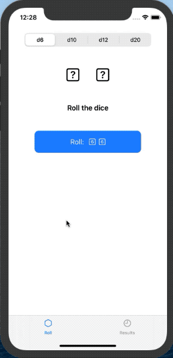

# Dicey

**Roll the dice. See past results.**

Your challenge this time can be easy or hard depending on how far you want to take it, but at its core the project is simple: you need to build an app that helps users roll dice then store the results they had.

At the very least you should have a tab view where the first tab lets users roll dice, and the second tab shows results from previous rolls. However, if you want to push yourself further you can try one or more of the following:

Let the user customize the dice that are rolled: how many of them, and what type: 4-sided, 6-sided, 8-sided, 10-sided, 12-sided, 20-sided, and even 100-sided.
Show the total rolled on the dice.
Store the results using Core Data so they are persistent.
Add haptic feedback when dice are rolled.
For a real challenge, make the value rolled by the dice flick through various possible values before settling on the final figure.
When I say “roll dice” you don’t need to create fancy 3D effects – just showing the numbers that were “rolled” is fine.

#### Technologies used:
- SwiftUI
- Codable, JSON Encoding & Decoding